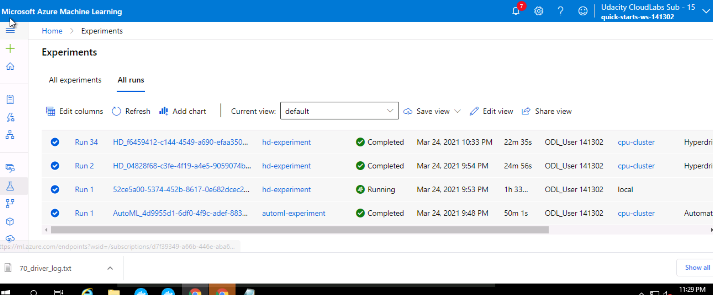
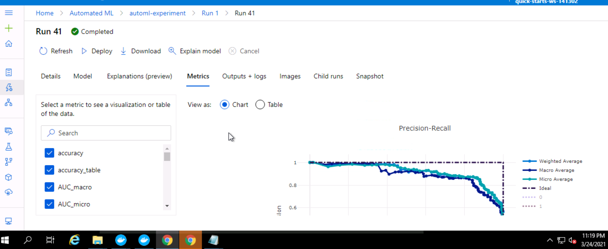

#  Prediction on Heart Failure using Microsoft Azure ML

This is a Machine Learning Project uses opensource dataset from Kaggle, prepaares two models and trains it with 2 different algorithms.
(i) using AutoML, (ii) using HyperDrive with tuned hyperparameters.
After comparing primaary metric, best model will later be deployed and tested.

## Dataset

### Overview
The data "Heart Failure" is taken from Kaggle repository.

**Citation:** Davide Chicco, Giuseppe Jurman: Machine learning can predict survival of patients with heart failure from serum creatinine and ejection fraction alone. BMC Medical Informatics and Decision Making 20, 16 (2020)

Heart failure is a common event caused by CVDs and this dataset contains 12 features that can be used to predict mortality by heart failure.
People with cardiovascular disease or who are at high cardiovascular risk (due to the presence of one or more risk factors such as hypertension, diabetes, hyperlipidaemia or already established disease) need early detection and management wherein a machine learning model can be of great help.

### Task
In this project, Azure AutoML and Hyperdrive will be used to make prediction on the death event based on patient's 12 clinical features.

**12 clinical features:**

- age: age of the patient (years)
- anaemia: decrease of red blood cells or hemoglobin (boolean)
- high blood pressure: if the patient has hypertension (boolean)
- creatinine phosphokinase (CPK): level of the CPK enzyme in the blood (mcg/L)
- diabetes: if the patient has diabetes (boolean)
- ejection fraction: percentage of blood leaving the heart at each contraction (percentage)
- platelets: platelets in the blood (kiloplatelets/mL)
- sex: woman or man (binary)
- serum creatinine: level of serum creatinine in the blood (mg/dL)
- serum sodium: level of serum sodium in the blood (mEq/L)
- smoking: if the patient smokes or not (boolean)
- time: follow-up period (days)

### Access
After having downloaded the Heart Failure Dataset from kaggle as a csv file, it is registered as a Dataset in the Azure Workspace in a Tabular form.
We uploaded from local system. It can be then accessed as **Dataset.get_by_name(ws, dataset_name)**

## Automated ML
The AutoML settings and configuration used are as follows:

Experiment timeout is a setting to control the use of resources. Maximum 4 iterations can be run simultaneously to
maximize usage. Classification task is performed as the target column DEATH_EVENT has binary (0,1) output with primary metric as Accuracy.
Featurization is also done which automatically scales and normalizes the dataset. 

### Results
The best performing model after training using AutoML is VotingEnsemble with the Accuracy of 88.49350649350649 %

The models that VotingEnsemble used with it's weight are:

To improve the model we can use different target metric like AUC_weighted or Recall. We can also try hypertuning the parameters to see if there is any improvement.

**Best Run Id**

**Best AutoML Model Registered**

## Hyperparameter Tuning
As it is a binary classification problem, this model used for HyperDrive is based on Logistic Regression. 
It is easy to understand and it trains very easily and faster compared to complex models.

The parameters used for hyperparameter tuning are:
- Regularization Strength (C) with range 0.1 to 1.0
    -- Inverse of regularization strength. Smaller values cause stronger regularization
- Max Iterations (max_iter) with values 50, 100, 150 and 200
    -- Maximum number of iterations to converge

### Results
The best Accuracy for the HyperDrive model is 0.7833333333333333
The best hyperparameters for this accuracy are:
- 'Regularization Strength:': 0.8701701613743549
- 'Max iterations:': 50

To improve the model we can use different target metric to get broader perspective. We can also try increasing the range of the hyperparameters to see if there is any improvement.

**Best HyperDrive Model Registered**

## Model Deployment
The AutoMl model is deployed  as a WebService using Azure Container Instance. Best run environment and score.py file is provided to the InferenceConfig.
Cpu_cores and memory_gb are initialized as 1 for the deployment configuration. The aci service is then created using workspace, aci service name, model, inference config and deployment configuration.

The model is successfully deployed as a web service and a REST endpoint is created with status was shown as Healthy. A scoring uri is also generated to test the endpoint.

###Endpoint Testing

The endpoint is tested in 2 ways: 
- using endpoint.py file which passes 2 data points as json 
- using 3 random sample data points and to see the actual value and predicted value 

## Screen Recording
Link to screencast: [Link](https://www.youtube.com/watch?v=34ZNb6Y1P6c)

## Future Improvements
- To increase data quality larger dataset can be used to  
- Different models can also be used with hyperparameter tuning
- Feature engineering can be performed using PCA 
